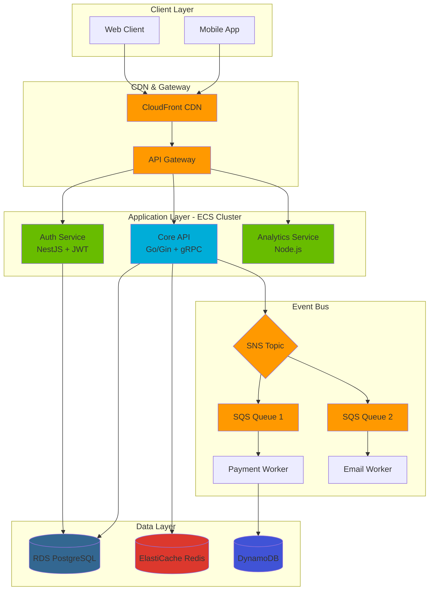

<div align="center">
  
</div>

<div align="center">
  
  [](https://git.io/typing-svg)

  <a href="https://github.com/Lucascabral95">
    
  </a>
  <a href="https://linkedin.com/in/lucas-gaston-cabral">
    
  </a>
  <a href="mailto:Lucassimple@hotmail.com">
    
  </a>

  📍 Tigre, Buenos Aires, Argentina | 🌐 [Portfolio](https://bit.ly/47unnek)

</div>

---

## 👨‍💻 Sobre Mí

Developer Full Stack con especialización en **Cloud Computing** y **Arquitecturas Distribuidas**. Mi enfoque combina desarrollo de software escalable con principios de DevOps y Site Reliability Engineering (SRE).

```typescript
const lucas = {
    rol: "Desarrollador Full Stack",
    ubicacion: "Buenos Aires, Argentina",
    especialidades: ["Arquitectura Cloud", "Microservicios", "Sistemas Event-Driven"],
    enfoqueActual: "Construyendo sistemas distribuidos resilientes en AWS",
    certificaciones: ["AWS Developer Associate", "Cisco Cybersecurity Analyst"],
    filosofia: "Clean Code + Automatización + Aprendizaje Continuo"
};
```

### 🎯 Competencias Principales

- **Ingeniería Backend:** Diseño de microservicios escalables con NestJS, Go y Node.js
- **Infraestructura Cloud:** Arquitectura serverless y contenerizada en AWS (ECS, Lambda, Fargate)
- **DevOps & IaC:** Automatización con Terraform, Docker, Kubernetes y pipelines CI/CD
- **Desarrollo Frontend:** SPAs modernas con React, Next.js y Angular
- **Diseño de Bases de Datos:** PostgreSQL, MongoDB, Redis, DynamoDB (SQL & NoSQL)
- **Seguridad & Autenticación:** Implementación de OAuth2, JWT, AWS Cognito

---

## 🏗️ Enfoque de Arquitectura de Sistemas

Mi metodología estándar para soluciones empresariales sigue patrones **Event-Driven** para garantizar desacoplamiento, escalabilidad y alta disponibilidad.



---

## 💼 Logros Profesionales

### 🚀 Logros Clave

| Desafío | Solución | Impacto |
|---------|----------|---------|
| **Alta Latencia en API** | Implementación de caché multinivel (L1 In-Memory + L2 Redis Cluster) y optimización de queries SQL | **30% de reducción** en latencia p95 |
| **Fallas en Despliegues** | Diseño de pipeline CI/CD con infraestructura inmutable usando GitHub Actions & Terraform | Despliegues **Blue/Green sin downtime** |
| **Cuellos de Botella** | Migración de monolito a arquitectura asíncrona usando RabbitMQ/SQS para procesamiento en segundo plano | **+200% de throughput** (RPS) |
| **Procesamiento de Pagos** | Sistema de transacciones event-driven con integración Stripe/MercadoPago | Procesamiento **asíncrono y seguro** |

### 🛠️ Experiencia en Producción

**Desarrollador Full Stack Freelance** | *Enero 2024 - Actualidad*

- ☁️ **Arquitectura Cloud:** Diseño de infraestructura serverless y contenerizada en AWS (ECS Fargate, Lambda) usando Terraform (IaC)
- 🔧 **Sistemas Backend:** Desarrollo de microservicios event-driven con NestJS y Go, integrando pasarelas de pago (Stripe, MercadoPago) y colas de mensajes (RabbitMQ, SQS)
- ⚡ **Optimización de Rendimiento:** Reducción del 30% en latencia mediante estrategias de caching y ajuste avanzado de queries en PostgreSQL/MongoDB
- 🧪 **Aseguramiento de Calidad:** Implementación de suites de testing completas (Unit, Integration, E2E) con Jest y React Testing Library, manteniendo +80% de cobertura de código
- 🔐 **Implementación de Seguridad:** Construcción de esquemas robustos de autenticación con AWS Cognito, OAuth2, JWT y Firebase Auth

---

## 🛠️ Stack Tecnológico

### Lenguajes & Frameworks

<div align="center">

<table>
<tr>
<td align="center" width="100">

<br><strong>TypeScript</strong>
</td>
<td align="center" width="100">

<br><strong>Golang</strong>
</td>
<td align="center" width="100">

<br><strong>Node.js</strong>
</td>
<td align="center" width="100">

<br><strong>Python</strong>
</td>
<td align="center" width="100">

<br><strong>NestJS</strong>
</td>
<td align="center" width="100">

<br><strong>Express</strong>
</td>
<td align="center" width="100">

<br><strong>Gin</strong>
</td>
</tr>
</table>

</div>

### Tecnologías Frontend

<div align="center">

<table>
<tr>
<td align="center" width="100">

<br><strong>React</strong>
</td>
<td align="center" width="100">

<br><strong>Next.js</strong>
</td>
<td align="center" width="100">

<br><strong>Angular</strong>
</td>
<td align="center" width="100">

<br><strong>Tailwind</strong>
</td>
<td align="center" width="100">

<br><strong>GraphQL</strong>
</td>
</tr>
</table>

</div>

### Cloud & DevOps

<div align="center">

<table>
<tr>
<td align="center" width="100">

<br><strong>AWS</strong>
</td>
<td align="center" width="100">

<br><strong>Docker</strong>
</td>
<td align="center" width="100">

<br><strong>Kubernetes</strong>
</td>
<td align="center" width="100">

<br><strong>Terraform</strong>
</td>
<td align="center" width="100">

<br><strong>GH Actions</strong>
</td>
<td align="center" width="100">

<br><strong>Jenkins</strong>
</td>
</tr>
</table>

</div>

### Bases de Datos & Caching

<div align="center">

<table>
<tr>
<td align="center" width="100">

<br><strong>PostgreSQL</strong>
</td>
<td align="center" width="100">

<br><strong>MongoDB</strong>
</td>
<td align="center" width="100">

<br><strong>Redis</strong>
</td>
<td align="center" width="100">

<br><strong>DynamoDB</strong>
</td>
<td align="center" width="100">

<br><strong>MySQL</strong>
</td>
<td align="center" width="100">

<br><strong>Firebase</strong>
</td>
</tr>
</table>

</div>

### Experiencia en Servicios AWS

```yaml
Cómputo & Orquestación:
  - AWS Lambda (Serverless)
  - Amazon ECS & Fargate (Contenedores)
  - Elastic Beanstalk
  - AWS Step Functions

Mensajería & Eventos:
  - Amazon SQS (Colas)
  - Amazon SNS (Pub/Sub)
  - Arquitectura Event-Driven

Datos & Almacenamiento:
  - Amazon RDS (PostgreSQL/MySQL)
  - Amazon DynamoDB
  - Amazon ElastiCache (Redis)
  - Amazon S3

Redes & Seguridad:
  - Amazon VPC
  - AWS Cognito
  - Políticas IAM
  - CloudFront CDN

DevOps & Monitoreo:
  - AWS CodePipeline
  - AWS CodeCommit
  - CloudWatch Logs & Metrics
  - X-Ray (Tracing)
```

---

<div align="center">
  <h2 style="color: #2F81F7;">📊 Estadísticas de GitHub</h2>
</div>

<div align="center">
  
  
</div>

<div align="center">
  
</div>

<div align="center">
  <h3 style="color: #2F81F7;">Gráfico de Actividad</h3>
</div>

<div align="center">
  
</div>

<div align="center">
  <h3 style="color: #2F81F7;">Gráfico de Contribución</h3>
</div>

<div align="center">
  
</div>

---

## 🎓 Educación & Certificaciones

<table>
<tr>
<td width="50%">

### 🎯 Certificaciones
- ☁️ **AWS Developer Associate** (2024)
- ☁️ **AWS Cloud Practitioner** (2024)
- 🔐 **Cisco Cybersecurity Analyst Junior** (2024)
- 📚 **React Native Avanzado** (Udemy, 2024)
- 🔧 **Angular Avanzado** (Udemy, 2024)
- 🔧 **NestJS Microservicios Avanzado** (Udemy, 2024)

</td>
<td width="50%">

### 🎓 Formación Académica
- 💻 **Desarrollo Full Stack** - Coderhouse (2023)
  - *Top 10 de la promoción*
- 🗄️ **SQL & Diseño de Bases de Datos** - Coderhouse (2023)

</td>
</tr>
</table>

---

## 🔥 Proyectos Destacados

### 🎫 SeatGuard: Enterprise Reservation Engine
**Stack Tecnológico:** Angular 20, Go (Gin), NestJS, PostgreSQL (Neon), AWS ECS Fargate, Lambda, SQS, Stripe, Terraform

Plataforma empresarial de microservicios con backend polyglot desplegado en AWS ECS Fargate. Implementa bloqueo de asientos en tiempo real con concurrencia optimista, procesamiento asíncrono de pagos mediante Lambda + SQS + Stripe, y arquitectura limpia siguiendo principios SOLID.

- ✅ Arquitectura de microservicios polyglot (Go + NestJS + Node.js)
- ✅ Infraestructura serverless en AWS con Terraform (IaC)
- ✅ Bloqueo de asientos en tiempo real con concurrencia optimista
- ✅ Procesamiento asíncrono event-driven con Lambda + SQS
- ✅ Frontend Angular 20 con SSR, Signals y Zoneless Change Detection
- ✅ [Demo en vivo](https://seat-guard-reservation-frontend.vercel.app/) | [Código Frontend](https://github.com/Lucascabral95/seat-guard-reservation-frontend) | [Código Backend](https://github.com/Lucascabral95/seat-guard-reservation-engine)

### 🛒 Chroma - E-commerce Full Stack
**Stack Tecnológico:** Next.js, NestJS, TypeScript, PostgreSQL (Neon), Prisma, Zustand, Tailwind CSS

E-commerce moderno con gestión de productos, carrito de compras inteligente, procesamiento de pagos con MercadoPago y autenticación JWT segura. Implementa SSR para SEO, caché parametrizado avanzado con TanStack Query y UI responsive premium.

- ✅ Autenticación y autorización con roles (USER, MANAGER, ADMIN)
- ✅ Gestión completa de productos con variantes y control de stock
- ✅ Carrito de compras con persistencia y sincronización entre dispositivos
- ✅ Integración con MercadoPago para procesamiento de pagos
- ✅ Cache parametrizado avanzado con TanStack Query
- ✅ [Demo en vivo](https://frontend-ecommerce-chroma.vercel.app/) | [Código Frontend](https://github.com/Lucascabral95/frontend-ecommerce-chroma) | [Código Backend](https://github.com/Lucascabral95/ecommerce-chrome-backend)

### 🔗 Linkly - URL Shortener Platform
**Stack Tecnológico:** Angular, NestJS, TypeScript, PostgreSQL (Neon), Prisma, Socket.io, Tailwind CSS

Plataforma full-stack de acortamiento de URLs con autenticación avanzada (local + OAuth Google), analíticas en tiempo real y sistema de recuperación de contraseña seguro. Panel administrativo con gestión de usuarios, roles (ADMIN, PREMIUM, FREE) y métricas detalladas.

- ✅ Acortamiento de URLs con alias personalizados
- ✅ Protección por contraseña y expiración automática de enlaces
- ✅ Panel de analíticas en tiempo real (clics, dispositivos, geolocalización)
- ✅ Autenticación OAuth 2.0 con Google
- ✅ Sistema de recuperación de contraseña con tokens autodestructivos
- ✅ [Demo en vivo](https://links-shorteners-linky.netlify.app/) | [Código Frontend](https://github.com/Lucascabral95/links-shorteners-linkly) | [Código Backend](https://github.com/Lucascabral95/links-shorteners)

---

## 📈 Crecimiento Profesional

```typescript
class RecorridoDesarrollador {
    private habilidades: Habilidad[] = [];
    
    constructor() {
        this.aprendizajeContinuo();
    }
    
    aprendizajeContinuo(): void {
        const enfoqueActual = [
            "Orquestación avanzada de Kubernetes",
            "Patrones de sistemas distribuidos (SAGA, CQRS)",
            "Seguridad de infraestructura (AWS Security Best Practices)",
            "Optimización de rendimiento a escala"
        ];
        
        this.habilidades.push(...enfoqueActual);
    }
    
    proximasMetas(): string[] {
        return [
            "AWS Solutions Architect Professional",
            "Certified Kubernetes Administrator (CKA)",
            "Contribuir a proyectos open-source cloud-native"
        ];
    }
}
```

---

## 🤝 Conectemos

<div align="center">

Siempre estoy abierto a discutir sobre **arquitectura cloud**, **patrones de microservicios** o **mejores prácticas de DevOps**. ¡No dudes en contactarme!

[](https://linkedin.com/in/lucas-gaston-cabral)
[](mailto:Lucassimple@hotmail.com)
[](https://bit.ly/47unnek)
[](https://github.com/Lucascabral95)

</div>

---

<div align="center">
  
  
  ### 💭 "La simplicidad es la máxima sofisticación" - Leonardo da Vinci
  
</div>
